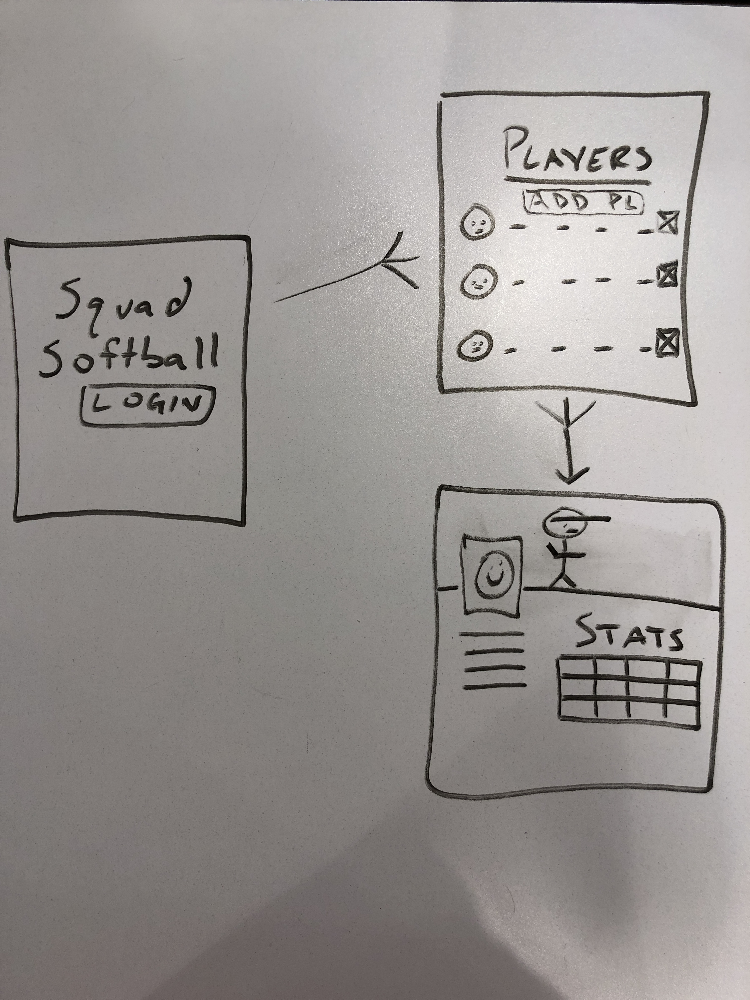

#Squad Softball
##Description
#### Squad Softball is an app that allows logged in users to view the players on a softball team.  Players can be added to, and deleted from, a main table.  Each player can be selected to view more information about that specific player.

##Getting Started
#### App Link - https://still-forest-91356.herokuapp.com/
#### 1. Upon access to the site, the user will be presented an opening screen with a LOGIN button
#### 2. When the user logs into the site, he/she will be presented with a table of players along with basic information about each
#### 3. The user can click an ADD PLAYER button at the top of the table to add a new player
#### 4. Each player in the table will have a button on his row so the user can delete the row (player)
#### 5. By clicking on a player's name in the table, the user will be directed to the player's page
#### 6. A nav bar will allow easy maneuvering throughout the site

##Wireframe

##Technologies Used
#### - NodeJS
#### - ExpressJS
#### - MongooseJS
#### - MongoDB
#### - Atlas
#### - Materialize
#### - HTML
#### - Javascript

##Future Goals
#### - The ability to update more than a player's position
#### - Add a schedule model so users can view when the next scheduled game is
#### - Include an API to connect the Google Sheet with each player's "career" stats